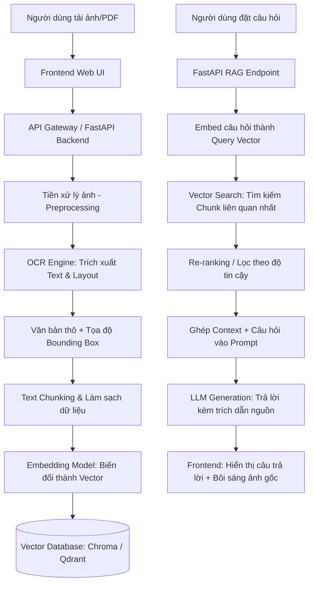

# 01. Tổng Quan Kiến Trúc Hệ Thống OCR + RAG + FastAPI

Tài liệu này cung cấp bức tranh toàn cảnh về cách xây dựng một hệ thống xử lý tài liệu thông minh: từ nhận diện chữ trong ảnh (OCR), lập chỉ mục và truy xuất ngữ nghĩa (RAG), đến phục vụ qua API (FastAPI) và giao diện người dùng.

---

## 1. Luồng Dữ Liệu Toàn Hệ Thống (End-to-End Workflow)

---

## 2. Tại Sao Phải Xây Dựng Hệ Thống Này Theo Từng Khối?

| Khối Chức Năng | Thao Tác Thực Hiện | Tại Sao Phải Làm Vậy? |
| :--- | :--- | :--- |
| **Tiền xử lý ảnh (Image Preprocessing)** | Deskew (xoay thẳng), Khử nhiễu, Tăng tương phản, Binarization | Ảnh chụp tài liệu từ người dùng thường bị mờ, nghiêng, ánh sáng kém. Nếu OCR trực tiếp thì tỷ lệ nhận diện sai chữ rất cao. |
| **Bộ trích xuất OCR** | Chuyển đổi pixel ảnh thành chuỗi ký tự UTF-8 kèm vị trí (Bounding Box) | Máy tính và LLM không hiểu trực tiếp hình ảnh văn bản dưới dạng ký tự nếu không được bóc tách. Bounding Box giúp sau này người dùng tra cứu được chữ đó nằm ở đâu trong ảnh. |
| **Làm sạch & Chunking (Cắt đoạn)** | Chia nhỏ văn bản theo đoạn văn, ngữ nghĩa hoặc cấu trúc bảng | LLM có giới hạn ngữ cảnh (Context Window) và chi phí token. Ngoài ra, vector search chỉ hiệu quả khi kích thước đoạn vừa vặn (semantic chunking). |
| **Vector Indexing (Lưu trữ Vector)** | Chuyển đổi text thành vector số học đa chiều và lưu vào Vector DB | Cho phép tìm kiếm ngữ nghĩa (Semantic Search) thay vì chỉ tìm kiếm từ khóa cứng (Keyword search). |
| **RAG Retrieval & Generation** | Lấy context liên quan nhất và yêu cầu LLM sinh câu trả lời | Ngăn chặn hiện tượng "ảo giác" (hallucination) của AI; câu trả lời được neo chặt chẽ vào dữ liệu tài liệu gốc. |

---

## 3. Các Phương Án Thiết Kế Kiến Trúc & Ưu Nhược Điểm

### Phương Án A: Kiến Trúc Nguyên Khối Tất Cả Trong Một (Monolithic Python FastAPI)
Toàn bộ OCR, RAG Pipeline, Vector DB và API gom vào 1 service FastAPI duy nhất.

* **Ưu điểm:**
  - Cực kỳ dễ code, dễ deploy, phù hợp cho giai đoạn thử nghiệm, nghiên cứu (Research/PoC) hoặc dự án vừa và nhỏ.
  - Không tốn chi phí gọi mạng nội bộ (Network Overhead) giữa các service.
* **Nhược điểm:**
  - Tác vụ OCR và nhúng Vector ngốn rất nhiều CPU/GPU/RAM. Khi có nhiều request đồng thời, toàn bộ web server có thể bị nghẽn (block event loop).

---

### Phương Án B: Kiến Trúc Microservices (Hệ thống phân tán)
- **Frontend:** React / Vue / Next.js
- **Backend Chính (BFF/Gateway):** Spring Boot (Java) hoặc FastAPI quản lý auth, nghiệp vụ, lưu trữ tài liệu.
- **AI Worker (Python FastAPI / Celery):** Chuyên trách chạy model OCR, Embedding và RAG thông qua Message Queue (RabbitMQ / Redis) hoặc gRPC / REST.

* **Ưu điểm:**
  - **Khả năng mở rộng (Scalability):** Có thể scale độc lập cụm AI Worker chạy GPU mà không ảnh hưởng tới API Web.
  - **Độ ổn định:** Nếu tác vụ OCR bị crash hoặc hết RAM (OOM), server nghiệp vụ chính vẫn hoạt động bình thường.
* **Nhược điểm:**
  - Độ phức tạp cao hơn, cần quản lý giao tiếp mạng, đồng bộ trạng thái bất đồng bộ (Asynchronous task tracking).

---

## 4. Quyết Định Kiến Trúc Cho Dự Án Này

Dự án này được thiết kế theo dạng **Modular Architecture** (có sẵn cây thư mục cho cả `ai-worker-python`, `backend-java`, `frontend`, và `storage`):
1. **Giai đoạn 1:** Xây dựng core AI Pipeline hoàn chỉnh trong `ai-worker-python` (FastAPI) để test độc lập nhanh chóng.
2. **Giai đoạn 2:** Kết nối giao tiếp với `backend-java` (nếu cần quản lý nghiệp vụ/doanh nghiệp) và `frontend` cho người dùng cuối.
