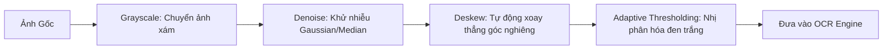

# 02. So Sánh Và Lựa Chọn Công Nghệ OCR (Nhận Diện Chữ Qua Ảnh)

Nhận diện ký tự quang học (OCR) là bước đầu vào quan trọng nhất của toàn bộ hệ thống RAG. Nếu dữ liệu đầu vào từ OCR bị sai lệch (ví dụ: sai số hóa đơn, mất dấu tiếng Việt, nhầm lẫn chữ hoa/thường), toàn bộ các bước RAG phía sau sẽ cho kết quả sai lệch.

---

## 1. Bảng So Sánh Các Công Nghệ OCR Phổ Biến

| Công Nghệ | Ngôn Ngữ Hỗ Trợ | Tốc Độ | Độ Chính Xác Tiếng Việt | Nhận Diện Layout & Bảng Biểu | Tài Nguyên Yêu Cầu |
| :--- | :--- | :--- | :--- | :--- | :--- |
| **Tesseract OCR (Google)** | Đa ngôn ngữ (có Tiếng Việt) | Nhanh | Trung bình (kém nếu ảnh mờ/nghiêng) | Kém | Nhẹ (chạy tốt trên CPU) |
| **EasyOCR (PyTorch)** | >80 ngôn ngữ | Vừa phải | Khá tốt | Cơ bản | Cần GPU để chạy nhanh |
| **PaddleOCR (Baidu)** | Rất mạnh đa ngôn ngữ | Rất nhanh | **Rất xuất sắc** | **Rất tốt** (hỗ trợ phân tích bảng PP-Structure) | Tối ưu hóa cực tốt cho cả CPU & GPU |
| **DocTR (Mindee)** | Đa ngôn ngữ | Vừa phải | Tốt | Tốt (hỗ trợ phân vùng văn bản) | Cần GPU/CPU tầm trung |
| **Vision LLM (Gemini 2.5/3, Qwen2.5-VL)** | Mọi ngôn ngữ | Chậm hơn | **Hoàn hảo (Hiểu cả ngữ cảnh)** | **Xuất sắc (Trích xuất JSON trực tiếp)** | Gọi qua Cloud API hoặc GPU VRAM lớn |

---

## 2. Phân Tích Chuyên Sâu Từng Cách & Ưu Nhược Điểm

### Cách 1: Tesseract OCR (Cách truyền thống)
- **Cơ chế:** Dùng thuật toán xử lý ảnh kết hợp mạng nơ-ron LSTM cổ điển.
- **Ưu điểm:**
  - Cài đặt đơn giản, thư viện nhẹ, không tốn RAM.
  - Phù hợp với tài liệu scan phẳng, rõ nét, font chữ in tiêu chuẩn.
- **Nhược điểm:**
  - Nhận diện tiếng Việt có dấu rất dễ bị lỗi nếu ảnh chụp điện thoại bị rung hoặc lóa sáng.
  - Không bảo toàn được cấu trúc bảng biểu (Table layout) hoặc văn bản nhiều cột.

---

### Cách 2: PaddleOCR / PP-Structure (Khuyên Dùng cho Hệ Thống Tự Host / Local)
- **Cơ chế:** Kết hợp mô hình Deep Learning phát hiện vùng chứa chữ (Text Detection - DBNet) và nhận diện ký tự (Text Recognition - SVTR).
- **Ưu điểm:**
  - **Tối ưu vượt trội cho tiếng Việt** (hỗ trợ dấu đầy đủ, ít sai sót).
  - Có module **PP-Structure** giúp nhận diện cấu trúc tài liệu phức tạp: tiêu đề, đoạn văn, bảng biểu (trích xuất thành HTML/Markdown table).
  - Tốc độ xử lý cực nhanh, hỗ trợ ONNX Runtime và TensorRT.
- **Nhược điểm:**
  - Dung lượng mô hình lớn hơn Tesseract, cần cài đặt thêm thư viện Deep Learning (`paddlepaddle` hoặc `onnxruntime`).

---

### Cách 3: Sử dụng Vision-Language Models (VLM) như Gemini Flash / GPT-4o-mini
- **Cơ chế:** Đưa thẳng ảnh vào mô hình Multimodal LLM kèm prompt yêu cầu trích xuất Markdown có cấu trúc hoặc JSON.
- **Ưu điểm:**
  - Không cần bước tiền xử lý ảnh phức tạp.
  - Tự động sửa lỗi chính tả ngữ cảnh (ví dụ: chữ bị nhòe nhưng mô hình vẫn suy đoán đúng ngữ nghĩa).
  - Trích xuất dữ liệu có cấu trúc (Key-Value pairs như Họ tên, Ngày sinh, Tổng tiền) trong một bước duy nhất.
- **Nhược điểm:**
  - Tốn chi phí API token khi xử lý hàng triệu trang tài liệu.
  - Cần có kết nối Internet (nếu dùng Cloud API).

---

## 3. Các Bước Tiền Xử Lý Ảnh Cần Thiết (Image Preprocessing)

Trước khi đưa ảnh vào bất kỳ OCR engine nào, cần thực hiện pipeline tiền xử lý bằng OpenCV:

### Tại sao phải làm các bước này?
1. **Grayscale & Thresholding:** Loại bỏ màu sắc nền không cần thiết, tăng độ tương phản giữa chữ và giấy.
2. **Deskew (Cân chỉnh góc nghiêng):** Các mô hình OCR quét theo dòng ngang. Nếu văn bản bị nghiêng góc 15-30 độ, mô hình sẽ quét cắt ngang các dòng chữ, dẫn đến nhận diện lộn xộn.
3. **Denoise:** Loại bỏ các hạt nhiễu do camera chụp trong điều kiện thiếu sáng.
