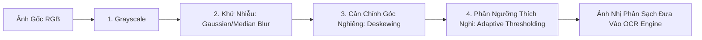
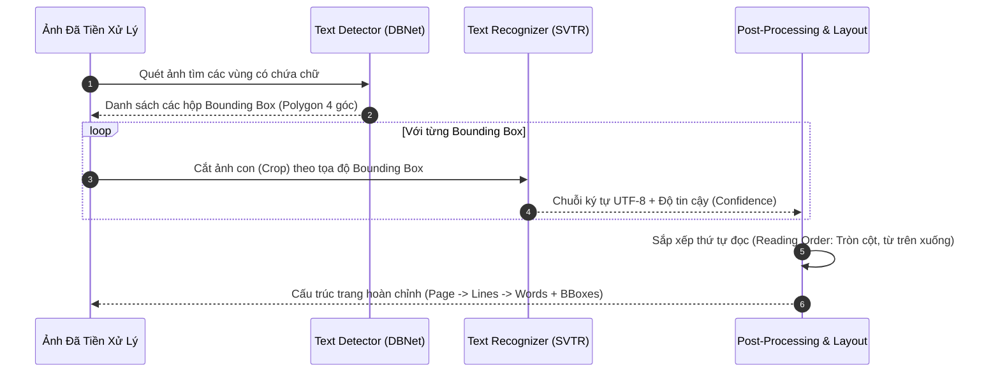

# 📚 GIÁO TRÌNH OCR TOÀN DIỆN: TỪ NỀN TẢNG ĐẾN THỰC CHIẾN CHUYÊN SÂU

> **Mục tiêu tài liệu:** Cung cấp kiến thức nền tảng về xử lý ảnh kỹ thuật số (Computer Vision), quy trình tiền xử lý bằng OpenCV, cơ chế nhận diện chữ quang học (OCR) sinh tọa độ Bounding Box, và các kỹ thuật bóc tách cấu trúc tài liệu nâng cao phục vụ cho hệ thống RAG.

---

## PHẦN 1: KIẾN THỨC NỀN TẢNG (FOUNDATIONS)

### 1.1. Bản Chất Của Ảnh Kỹ Thuật Số Dưới Góc Nhìn Máy Tính

Một bức ảnh tài liệu thực chất là một ma trận số học 2 chiều hoặc 3 chiều:
* **Ảnh màu (RGB):** Ma trận 3 kênh $H \times W \times 3$, mỗi điểm ảnh (pixel) là một bộ 3 giá trị $(R, G, B)$ từ $0$ đến $255$.
* **Ảnh xám (Grayscale):** Ma trận 1 kênh $H \times W$, mỗi pixel đại diện cho cường độ sáng (Luminance) từ $0$ (đen tuyền) đến $255$ (trắng tinh).
* **Ảnh nhị phân (Binary Image):** Chỉ gồm 2 giá trị: $0$ (chữ/mực) và $255$ (nền giấy).

```text
Ảnh chụp tài liệu:
[R, G, B] ---> Công thức độ sáng ---> [Mức xám 0-255] ---> Phân ngưỡng ---> [0 hoặc 255]
(3 Kênh màu)                          (Grayscale)                           (Nhị phân)
```

#### Công thức chuyển đổi ảnh màu sang ảnh xám chuẩn ITU-R BT.601:
Mắt người nhạy cảm nhất với màu xanh lá cây (Green), tiếp đến là màu đỏ (Red) và ít nhạy nhất với màu xanh dương (Blue). Do đó, phép chuyển đổi không lấy trung bình cộng đơn giản mà dùng trọng số:
$$Y = 0.299 \times R + 0.587 \times G + 0.114 \times B$$

---

### 1.2. Những Thách Thức Khi Nhận Diện Chữ Trên Tài Liệu Chụp Bằng Điện Thoại

Khác với tài liệu PDF xuất từ máy tính (PDF số hóa có sẵn lớp text vector), ảnh chụp tài liệu thực tế gặp 5 vấn đề nghiêm trọng:
1. **Nghiêng méo (Skew / Rotation):** Người chụp đặt điện thoại không thẳng, khiến dòng chữ bị xiên góc $5^{\circ} - 30^{\circ}$.
2. **Ánh sáng không đồng đều & Bóng đổ (Shadows):** Tay người chụp hoặc bóng đèn tạo ra vùng tối cục bộ trên trang giấy.
3. **Nhiễu hạt (Noise):** Cảm biến camera trong điều kiện thiếu sáng sinh ra các chấm lấm tấm hạt muối tiêu (Salt-and-Pepper noise).
4. **Độ tương phản thấp (Low Contrast):** Mực nhạt, giấy ố vàng hoặc nền có hoa văn chìm.
5. **Mờ do chuyển động (Motion Blur / Out of focus):** Chữ bị nhòe nét khi camera rung tay.

---

### 1.3. Toán Học Tiền Xử Lý Ảnh Với OpenCV (Image Preprocessing)

Trước khi đưa ảnh vào mô hình Deep Learning OCR, ta phải đưa ảnh qua một chuỗi biến đổi hình học và xử lý tín hiệu:



#### A. Khử Nhiễu (Denoising)
* **Gaussian Blur:** Tích chập ma trận ảnh với hạt nhân Gauss (Gaussian Kernel) để làm mịn viền hạt nhiễu.
* **Median Filter (Bộ lọc trung vị):** Cực kỳ hiệu quả để xóa các chấm nhiễu muối tiêu mà **vẫn giữ sắc nét các đường viền cạnh của nét chữ**.

#### B. Phân Ngưỡng Thích Nghi (Adaptive Thresholding) vs Phân Ngưỡng Toàn Cục (Otsu)
* **Tại sao không dùng ngưỡng cố định (Global Threshold)?** Nếu trang giấy có bóng đổ (nửa trên sáng, nửa dưới tối), một ngưỡng cố định $T = 127$ sẽ khiến nửa trên mất chữ hoặc nửa dưới bị biến thành một mảng đen ngòm.
* **Adaptive Thresholding:** Tính toán giá trị ngưỡng riêng biệt cho từng vùng lân cận $B \times B$ pixel:
  $$T(x, y) = \text{Mean}(B(x, y)) - C$$
  *(Trong đó $\text{Mean}(B(x,y))$ là cường độ sáng trung bình của ô vuông xung quanh điểm $(x, y)$, và $C$ là hằng số bù trừ).* Nhờ đó, chữ nằm trong vùng bóng tối vẫn được bóc tách rõ nét.

#### C. Thuật Toán Cân Chỉnh Góc Nghiêng (Deskewing Algorithm)
1. Xác định tọa độ của tất cả các pixel mang nét chữ ($pixel > 0$).
2. Tìm hình chữ nhật có diện tích nhỏ nhất bao quanh tập điểm đó bằng giải thuật `cv2.minAreaRect(points)`.
3. Lấy ra góc nghiêng $\theta$. Nếu góc $|\theta| > 0.5^{\circ}$, tính ma trận biến đổi Affine xoay:
   $$M = \begin{bmatrix} \cos\theta & -\sin\theta \\ \sin\theta & \cos\theta \end{bmatrix}$$
4. Xoay phẳng ảnh bằng `cv2.warpAffine` để các dòng chữ nằm hoàn toàn theo phương ngang.

---

## PHẦN 2: QUY TRÌNH THỰC HIỆN CHI TIẾT (STEP-BY-STEP WORKFLOW)

Mô hình OCR hiện đại (như PaddleOCR, DocTR) không nhận diện cả trang ảnh cùng lúc mà tách thành 2 giai đoạn riêng biệt:



---

### 2.1. Phát Hiện Vùng Chữ (Text Detection - DBNet)
* **Nhiệm vụ:** Tìm ra tọa độ chính xác của từng dòng chữ trên ảnh.
* **Kiến trúc DBNet (Differentiable Binarization Network):**
  - Mô hình sinh ra một Probability Map (bản đồ xác suất điểm ảnh là chữ) và Threshold Map (ngưỡng nhị phân thích ứng).
  - Tự động uốn theo các dòng chữ xiên, cong hoặc chữ in trên nhãn bao bì phức tạp.
  - Kết quả trả về là tọa độ 4 điểm góc của đa giác:
    $$BBox = [[x_1, y_1], [x_2, y_2], [x_3, y_3], [x_4, y_4]]$$

---

### 2.2. Nhận Diện Ký Tự (Text Recognition - SVTR / CRNN)
* **Nhiệm vụ:** Đọc ảnh con chứa một dòng chữ và phiên âm thành chuỗi ký tự UTF-8.
* **Cơ chế SVTR (Single Visual Model for Text Recognition):**
  - Áp dụng kiến trúc Vision Transformer (ViT) bóc tách đặc trưng thị giác của từng ký tự.
  - Sử dụng hàm mất mát **CTC Loss (Connectionist Temporal Classification)** để tự động căn chỉnh vị trí ký tự mà không cần gán nhãn từng chữ cái riêng biệt trong quá trình huấn luyện.
* **Độ tin cậy (Confidence Score):** Giá trị từ $0.0$ đến $1.0$ thể hiện mức độ chắc chắn của mô hình đối với kết quả nhận diện.

---

### 2.3. Hệ Tọa Độ Bounding Box & Chuẩn Hóa (Normalized Bounding Box)

#### Tại sao phải chuẩn hóa tọa độ về dải $[0.0, 1.0]$?
* **Tọa độ tuyệt đối (Absolute Pixels):** Phụ thuộc vào độ phân giải ảnh gốc (ví dụ: ảnh scan $4000 \times 3000$ thì $x = 1500, y = 800$).
* **Vấn đề:** Khi hiển thị trên trình duyệt Web (Frontend) hoặc điện thoại di động, kích thước hiển thị của thẻ ảnh (``) thường bị co lại (ví dụ $800 \times 600$). Nếu dùng tọa độ tuyệt đối, khung bôi sáng (highlight) sẽ bị lệch hoàn toàn!
* **Tọa độ chuẩn hóa (Normalized):**
  $$x_{\text{norm}} = \frac{x_{\text{pixel}}}{W_{\text{ảnh}}}, \quad y_{\text{norm}} = \frac{y_{\text{pixel}}}{H_{\text{ảnh}}}$$
  $\Rightarrow$ Tọa độ luôn nằm trong đoạn $[0.0, 1.0]$, giúp Frontend chỉ cần nhân với kích thước màn hình bất kỳ là hiển thị chính xác $100\%$.

---

### 2.4. Thuật Toán Sắp Xếp Thứ Tự Đọc (Reading Order Reconstruction)

Mô hình Text Detection trả về các Bounding Box theo thứ tự ngẫu nhiên của thuật toán quét mạng nơ-ron. Nếu không sắp xếp lại, nội dung văn bản sẽ bị đảo lộn lộn xộn.

#### Thuật toán Line Grouping & Reading Order:
1. **Lọc theo phương thẳng đứng ($Y$-axis):** Nhóm các box có độ chênh lệch tâm $Y$ nhỏ hơn một nửa chiều cao dòng chữ ($\Delta Y < 0.5 \times H_{\text{line}}$) vào cùng một dòng.
2. **Sắp xếp dòng từ trên xuống dưới:** Sắp xếp các nhóm dòng theo thứ tự $Y_{\text{top}}$ tăng dần.
3. **Sắp xếp chữ từ trái sang phải:** Trong cùng một dòng, sắp xếp các từ theo $X_{\text{left}}$ tăng dần.
4. **Xử lý tài liệu 2 cột (Multi-column):** Phân chia tài liệu thành các dải cột dọc trước khi áp dụng sắp xếp dòng.

---

## PHẦN 3: KIẾN THỨC CHUYÊN SÂU & TỐI ƯU THỰC CHIẾN (ADVANCED OCR)

### 3.1. Phân Tích Cấu Trúc Tài Liệu (Document Layout Analysis - DLA)

Hệ thống OCR cao cấp không chỉ đọc từng chữ rời rạc mà phân loại từng vùng văn bản thành các thành phần cấu trúc ngữ nghĩa (Semantic Elements):

```text
[Header / Title]  --> Tiêu đề tài liệu
[Paragraph]       --> Đoạn văn xuôi
[Table]           --> Bảng biểu (cần giữ nguyên cấu trúc hàng & cột)
[List / Itemize]  --> Danh sách gạch đầu dòng
[Figure / Caption]--> Hình vẽ và chú thích
```

Khi đưa vào RAG:
* Tiêu đề (`Title`) được dùng để gắn Metadata phân cấp cho các chunk bên dưới.
* Bảng (`Table`) được chuyển đổi trực tiếp thành cú pháp **Markdown Table** hoặc **HTML `<table>`** để mô hình ngôn ngữ lớn (LLM) hiểu được mối quan hệ giữa hàng và cột.

---

### 3.2. Đánh Giá Độ Chính Xác Của OCR (Metrics: CER & WER)

Trong môi trường chuyên nghiệp, độ chính xác của OCR được đo lường bằng khoảng cách chỉnh sửa Levenshtein (Levenshtein Distance):

1. **Tỷ lệ lỗi ký tự (Character Error Rate - CER):**
   $$CER = \frac{S + D + I}{N}$$
   *(Trong đó: $S$ là số ký tự bị thay thế sai, $D$ là số ký tự bị bỏ sót, $I$ là số ký tự bị thêm thừa, $N$ là tổng số ký tự trong văn bản chuẩn Ground Truth).*
   * Hệ thống OCR đạt chuẩn sản xuất cho tiếng Việt cần đạt $CER < 2\% - 3\%$.

2. **Tỷ lệ lỗi từ (Word Error Rate - WER):**
   Đo lường tương tự nhưng ở cấp độ từ ngữ hoàn chỉnh.

---

### 3.3. So Sánh Chi Tiết Các Kiến Trúc Mô Hình OCR

| Đặc Điểm | Tesseract 5 (LSTM) | PaddleOCR (PP-OCRv4) | Vision LLM (Gemini 1.5 Flash / Qwen-VL) |
| :--- | :--- | :--- | :--- |
| **Kiến trúc phát hiện** | Cổ điển (Dựa trên đường cơ sở textline) | DBNet (Deep Learning) | Không cần (End-to-End Vision-Language) |
| **Nhận diện tiếng Việt** | Dễ nhầm dấu (ví dụ: `á`, `à`, `ã`) khi ảnh mờ | **Rất mạnh (Từ vựng tiếng Việt phong phú)** | **Hoàn hảo (Tự sửa lỗi dựa vào ngữ cảnh)** |
| **Xuất Bounding Box** | Có (Cấp từ và dòng) | Có (Cấp từ, dòng và đa giác 4 điểm) | Có (Normalized Bounding Box qua Structured Output) |
| **Tốc độ xử lý** | ~0.5s / trang (CPU) | **~0.2s / trang (GPU) hoặc ~0.8s (CPU)** | ~1.5s - 3s / trang (Phụ thuộc mạng/API) |
| **Chi phí vận hành** | Miễn phí (Mã nguồn mở) | Miễn phí (Mã nguồn mở, tự host) | Trả phí theo Token ảnh |
| **Khuyên dùng khi** | Ứng dụng rất nhẹ, không có GPU | **Hệ thống On-Premise, bảo mật nội bộ, tốc độ cao** | Tài liệu cực khó, chữ viết tay nghệch ngoạc, chiết xuất JSON |
