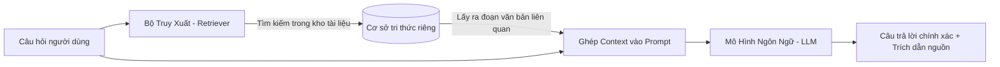
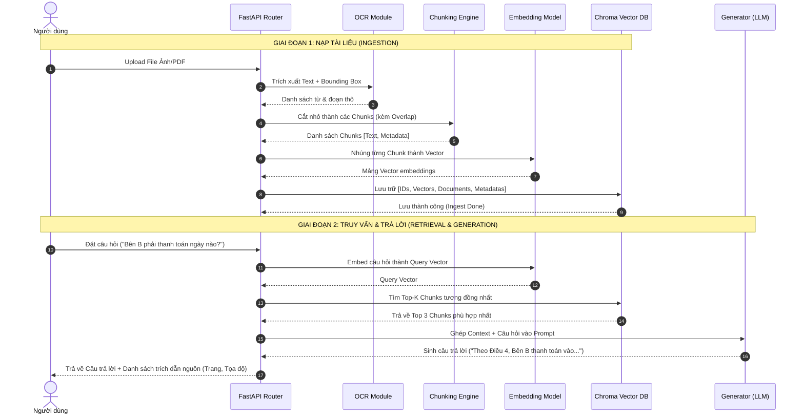
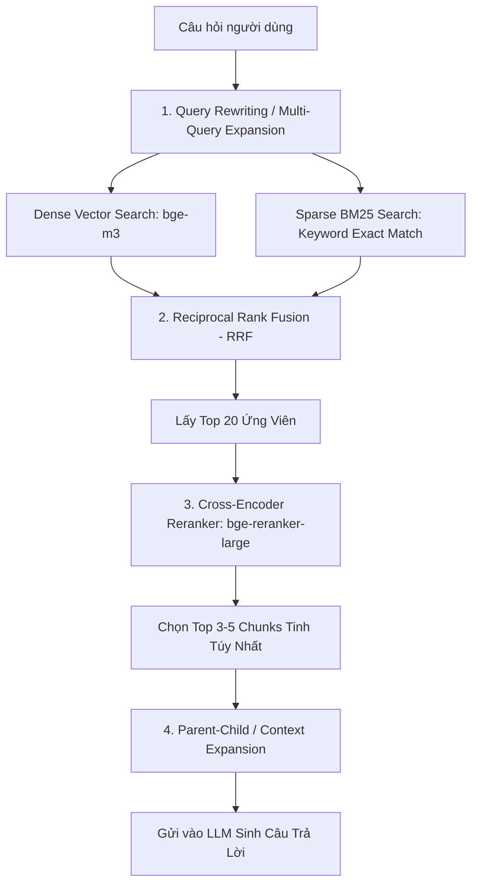
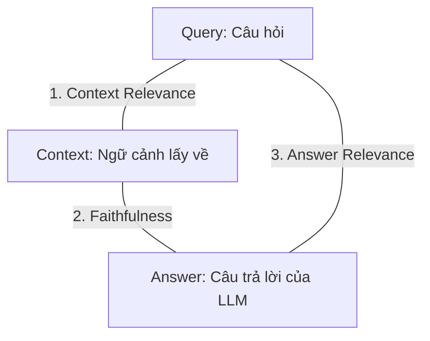

# 📚 GIÁO TRÌNH RAG TOÀN DIỆN: TỪ NỀN TẢNG ĐẾN THỰC CHIẾN CHUYÊN SÂU

> **Mục tiêu tài liệu:** Cung cấp lộ trình học tập bài bản, đi từ các nguyên lý toán học và khái niệm cốt lõi (Nền tảng), qua quy trình triển khai từng bước trong mã nguồn (Quy trình), đến các kỹ thuật tối ưu hóa cấp cao trong môi trường sản xuất (Chuyên sâu).

---

## PHẦN 1: KIẾN THỨC NỀN TẢNG (FOUNDATIONS)

### 1.1. RAG Là Gì? Tại Sao Các Mô Hình Ngôn Ngữ Lớn (LLM) Cần RAG?

**RAG (Retrieval-Augmented Generation - Tạo sinh tăng cường truy xuất)** là kiến trúc kết hợp giữa:
1. **Retrieval (Truy xuất):** Một hệ thống tìm kiếm thông tin liên quan từ kho dữ liệu riêng của bạn (tài liệu, PDF, ảnh OCR, hóa đơn, cơ sở dữ liệu nội bộ).
2. **Augmented (Tăng cường):** Bổ sung các thông tin vừa tìm được vào ngữ cảnh (Prompt) gửi tới LLM.
3. **Generation (Tạo sinh):** LLM đọc hiểu ngữ cảnh được cung cấp và tổng hợp thành câu trả lời chính xác, kèm trích dẫn nguồn.



#### ❌ 4 Giới Hạn Cốt Lõi Của LLM Thuần Túy:
1. **Điểm dừng tri thức (Knowledge Cutoff):** LLM chỉ biết thông tin đến ngày nó được huấn luyện xong.
2. **Ảo giác (Hallucination):** Khi không biết câu trả lời, LLM có xu hướng "tự bịa" ra thông tin nghe rất thuyết phục nhưng sai sự thật.
3. **Không có dữ liệu riêng tư (Private Data):** LLM của OpenAI, Google, hay Meta không thể biết nội dung hợp đồng, tài liệu nội bộ hay hóa đơn cá nhân của bạn.
4. **Giới hạn bộ nhớ ngữ cảnh & Chi phí:** Đưa toàn bộ tài liệu 1000 trang vào mỗi câu hỏi sẽ làm chi phí token tăng vọt và làm giảm độ tập trung của mô hình (hiện tượng "Lost in the Middle").

#### ⚖️ So Sánh: RAG vs Fine-tuning vs Long-Context Window

| Tiêu Chí | RAG (Truy xuất tăng cường) | Fine-tuning (Huấn luyện bổ sung) | Long-Context LLM (Nhồi hết văn bản) |
| :--- | :--- | :--- | :--- |
| **Cập nhật dữ liệu mới** | 🟢 **Tức thì** (Chỉ cần nạp file vào Vector DB) | 🔴 **Chậm & Đắt** (Phải gom dataset và train lại) | 🟡 **Tức thì** (Nhưng phải tải lại toàn bộ file mỗi lần chat) |
| **Khả năng trích dẫn nguồn** | 🟢 **Chính xác từng trang, từng dòng, từng ảnh** | 🔴 **Không thể** (Tri thức bị nén thành trọng số mạng nơ-ron) | 🟡 **Khá tốt** (Nhưng dễ bỏ sót đoạn giữa) |
| **Chi phí vận hành (Inference)** | 🟢 **Rất thấp** (Chỉ gửi 3-5 đoạn liên quan nhất) | 🟡 **Trung bình** | 🔴 **Cực đắt** (Tính tiền token theo toàn bộ tài liệu) |
| **Nguy cơ ảo giác** | 🟢 **Thấp nhất** (Có thể ép buộc trả lời dựa trên context) | 🔴 **Vẫn cao** | 🟡 **Trung bình** |
| **Phù hợp cho** | Tra cứu tài liệu, hỏi đáp văn bản, hóa đơn, OCR | Thay đổi giọng văn (Tone of voice), học ngữ pháp/ngôn ngữ mới | Đọc tóm tắt nhanh 1 cuốn sách ngắn |

---

### 1.2. Bản Chất Toán Học Của Vector, Embedding & Đo Khoảng Cách Ngữ Nghĩa

#### A. Embedding (Nhúng Từ/Đoạn) Là Gì?
Máy tính không hiểu được ý nghĩa chữ viết `"Hợp đồng lao động"`. Để máy tính hiểu, chúng ta dùng một mạng nơ-ron (Embedding Model) để ánh xạ chuỗi văn bản thành một **vectơ số học nhiều chiều** (thường từ 384 đến 1536 chiều).

```text
"Hợp đồng thuê nhà"   -->  [ 0.142, -0.891,  0.034, ...,  0.512 ] (768 chiều)
"Thỏa thuận thuê trọ" -->  [ 0.139, -0.885,  0.038, ...,  0.509 ] (Gần nhau trong không gian)
"Công thức nấu phở"   -->  [-0.781,  0.210, -0.654, ..., -0.118 ] (Rất xa nhau trong không gian)
```

#### B. Các Công Thức Đo Độ Tương Đồng (Similarity Metrics)

1. **Cosine Similarity (Độ tương đồng Cosin - Khuyên dùng nhất trong NLP/RAG):**
   Đo góc $\theta$ giữa hai vectơ trong không gian. Giá trị nằm trong khoảng $[-1, 1]$ (hoặc $[0, 1]$ nếu không có giá trị âm). Giá trị càng gần $1$ thì hai văn bản càng đồng nghĩa.
   $$\text{Cosine Similarity}(\mathbf{A}, \mathbf{B}) = \cos(\theta) = \frac{\mathbf{A} \cdot \mathbf{B}}{\|\mathbf{A}\| \|\mathbf{B}\|} = \frac{\sum_{i=1}^{n} A_i B_i}{\sqrt{\sum_{i=1}^{n} A_i^2} \sqrt{\sum_{i=1}^{n} B_i^2}}$$
   * **Tại sao nên dùng:** Cosine Similarity chỉ quan tâm đến **hướng** của vector (tức là ngữ nghĩa), không bị ảnh hưởng bởi độ dài ngắn của đoạn văn bản.

2. **Euclidean Distance (Khoảng cách L2):**
   Đo khoảng cách đường thẳng giữa 2 điểm đầu mút của vector:
   $$d(\mathbf{A}, \mathbf{B}) = \sqrt{\sum_{i=1}^{n} (A_i - B_i)^2}$$
   * Khoảng cách càng nhỏ ($d \to 0$) thì hai đoạn càng tương đồng.

3. **Dot Product (Tích vô hướng):**
   $$\mathbf{A} \cdot \mathbf{B} = \sum_{i=1}^{n} A_i B_i$$
   * Nếu các vector đã được chuẩn hóa độ dài về 1 ($\|\mathbf{A}\| = 1$), Dot Product chính là Cosine Similarity và có tốc độ tính toán cực nhanh.

---

### 1.3. Vector Database Hoạt Động Như Thế Nào?

Khi bạn có 1 triệu đoạn văn bản, việc so sánh tuần tự câu hỏi với 1 triệu vector (Brute-force Flat Search) sẽ rất chậm ($O(N)$). 

**Vector Database (như ChromaDB, Qdrant, Milvus)** sử dụng thuật toán **ANN (Approximate Nearest Neighbor - Tìm kiếm lân cận gần đúng)**:
* **HNSW (Hierarchical Navigable Small World):** Xây dựng đồ thị đa tầng liên kết các vector gần nhau. Khi tìm kiếm, thuật toán nhảy nhanh qua các tầng trên cùng rồi hội tụ dần về các node lân cận ở tầng đáy ($O(\log N)$).
* **Lưu trữ Metadata kèm theo:** Cho phép lọc kết hợp (Filtered Search) như: `vector_similarity(query) WHERE document_id == 'HD_2026' AND page_number == 3`.

---

## PHẦN 2: QUY TRÌNH THỰC HIỆN CHI TIẾT (STEP-BY-STEP WORKFLOW)

Quy trình xây dựng hệ thống RAG gồm 2 giai đoạn lớn:



---

### 2.1. Chi Tiết Kỹ Thuật Chunking (Cắt Đoạn)

#### Tại sao không được bỏ qua bước Chunking?
1. Mô hình Embedding có giới hạn token đầu vào (ví dụ: `bge-m3` tối đa 8192 tokens, các mô hình nhẹ là 512 tokens).
2. Nếu embed cả một cuốn sách thành 1 vector duy nhất, vector đó sẽ bị "loãng nghĩa" và không thể tìm thấy câu trả lời cho một chi tiết nhỏ.
3. Nếu cắt quá ngắn (1 câu 1 chunk), câu đó sẽ mất ngữ cảnh của đoạn xung quanh (ví dụ: câu *"Anh ấy đồng ý"* sẽ không biết *"Anh ấy"* là ai nếu không có câu trước).

#### Chiến Lược: Recursive Character Chunking với Overlap
* **Chunk Size:** Độ dài tối đa của mỗi đoạn (ví dụ: 500 ký tự).
* **Chunk Overlap:** Số lượng ký tự lặp lại giữa đoạn trước và đoạn sau (ví dụ: 100 ký tự).

```text
Văn bản gốc: [============================== ĐIỀU KHOẢN HỢP ĐỒNG ===============================]

Chunk 1:    [--------------------- 500 ký tự ---------------------]
                                      [=== 100 ký tự gối đầu ===]
Chunk 2:                              [--------------------- 500 ký tự ---------------------]
                                                                [=== 100 ký tự gối đầu ===]
Chunk 3:                                                        [--------------------- ...]
```
* **Mục đích của Overlap:** Đảm bảo các ý nghĩa nằm ở ranh giới cắt không bị đứt gãy.

---

### 2.2. Prompt Engineering Chuẩn Mực Cho RAG Chống Ảo Giác

Cấu trúc System Prompt chuẩn để ép buộc LLM không được bịa đặt:

```markdown
Bạn là trợ lý AI chuyên gia phân tích tài liệu OCR.
Dưới đây là các đoạn thông tin trích xuất từ tài liệu gốc được người dùng cung cấp:

================ CONTEXT BẮT ĐẦU ================
[Nguồn: Hợp đồng A | Trang: 2 | Đoạn: 1]
Bên B có nghĩa vụ thanh toán đợt 1 số tiền 50.000.000 VNĐ trong vòng 05 ngày kể từ ngày ký.

[Nguồn: Hợp đồng A | Trang: 3 | Đoạn: 2]
Mọi tranh chấp phát sinh sẽ được giải quyết tại Tòa án nhân dân TP. Hà Nội.
================ CONTEXT KẾT THÚC ================

QUY TẮC BẮT BUỘC:
1. Chỉ trả lời dựa trên thông tin có trong phần CONTEXT ở trên.
2. Nếu trong CONTEXT không có đủ thông tin để trả lời, bạn BẮT BUỘC phải nói: "Tài liệu được cung cấp không có thông tin về vấn đề này." Tuyệt đối không tự suy diễn hoặc dùng kiến thức bên ngoài.
3. Luôn trích dẫn rõ thông tin bạn lấy ra nằm ở Trang số mấy trong tài liệu.

Câu hỏi của người dùng: {user_query}
Câu trả lời của bạn:
```

---

## PHẦN 3: KIẾN THỨC CHUYÊN SÂU & KỸ THUẬT TỐI ƯU THỰC CHIẾN (ADVANCED RAG)

Khi triển khai thực tế trong doanh nghiệp, mô hình Naive RAG cơ bản (chỉ cắt đoạn rồi tìm cosine) thường chỉ đạt độ chính xác khoảng 60-70%. Để nâng lên **95%+**, ta cần áp dụng các kỹ thuật sau:



---

### 3.1. Hybrid Search (Dense Vector + Sparse BM25) & RRF

#### Điểm yếu của từng phương pháp khi đứng riêng lẻ:
* **Dense Vector Search:** Rất giỏi hiểu ngữ nghĩa trừu tượng (ví dụ: tìm `"chi phí thuê"` khi tài liệu ghi `"tiền phòng"`). Nhưng **rất kém** khi tìm mã định danh chính xác (ví dụ: tìm `"Mã số thuế: 0109988221"` hay mã linh kiện `"IC-STM32F407"`).
* **Sparse BM25 Search:** Ngược lại, BM25 so khớp từ khóa chính xác từng ký tự nhưng không hiểu từ đồng nghĩa.

#### Thuật toán Hợp Nhất Xếp Hạng RRF (Reciprocal Rank Fusion):
Khi kết hợp kết quả từ Dense Search và BM25, mỗi đoạn tài liệu $d$ được tính điểm tổng hợp theo công thức:
$$RRF\_Score(d) = \sum_{m \in M} \frac{1}{k + rank_m(d)}$$
*(Trong đó $M = \{\text{Dense}, \text{BM25}\}$, $k$ là hằng số làm mượt, thường chọn $k = 60$, $rank_m(d)$ là thứ hạng của tài liệu trong danh sách $m$).*

---

### 3.2. Reranking (Tái Xếp Hạng Bằng Cross-Encoder)

#### Sự khác biệt cốt lõi giữa Bi-Encoder và Cross-Encoder:
* **Bi-Encoder (Mô hình Embedding thông thường):** Nhúng câu hỏi riêng, nhúng tài liệu riêng thành 2 vector độc lập, rồi tính Cosine Similarity.
  * *Ưu điểm:* Cực nhanh, vector tài liệu tính trước được.
  * *Nhược điểm:* Câu hỏi và tài liệu không có sự tương tác qua lại giữa các tầng Attention (Self-Attention) trong mạng Transformer.
* **Cross-Encoder (Mô hình Reranker):** Đưa đồng thời cả cặp `[Câu hỏi, Đoạn văn]` vào mạng Transformer cùng lúc. Mọi từ trong câu hỏi được soi chiếu trực tiếp với từng từ trong đoạn văn.
  * *Ưu điểm:* Độ chính xác cực kỳ cao, loại bỏ hoàn toàn các đoạn "có vẻ liên quan nhưng thực chất lạc đề".
  * *Nhược điểm:* Chậm hơn, không tính trước được. Do đó chỉ dùng Reranker trên Top 20 kết quả do Vector Search lọc ra.

---

### 3.3. Parent-Document Retrieval (Truy Xuất Phụ Huynh - Con)

* **Vấn đề:** Khi chunk nhỏ (100 từ), vector embedding rất tập trung và chính xác, nhưng khi đưa vào LLM thì ngữ cảnh bị hẹp. Khi chunk lớn (1000 từ), ngữ cảnh đủ rộng cho LLM nhưng vector embedding lại bị mờ nhạt.
* **Giải pháp Parent-Document:**
  1. Chia tài liệu thành các **Parent Chunks** lớn (ví dụ: 1000 từ).
  2. Tiếp tục bẻ nhỏ mỗi Parent Chunk thành các **Child Chunks** (ví dụ: 200 từ).
  3. Chỉ embed và lưu vector của các **Child Chunks**.
  4. Khi người dùng hỏi: Tìm kiếm theo **Child Chunks**, nhưng khi tìm thấy Child Chunk phù hợp, hệ thống sẽ tự động lấy **Parent Chunk** tương ứng để gửi cho LLM!

---

### 3.4. Đánh Giá Chất Lượng Hệ Thống RAG (RAGAS Framework)

Để biết hệ thống RAG có tốt hay không, không thể đánh giá cảm tính. Ngành công nghiệp sử dụng bộ 3 chỉ số **RAG Triad**:



1. **Context Relevance (Độ phù hợp của ngữ cảnh):** Các đoạn văn bản Vector DB lấy về có thực sự chứa câu trả lời cho câu hỏi không? (Đo chất lượng của Retriever).
2. **Faithfulness / Groundedness (Độ trung thực):** Mọi ý trong câu trả lời của LLM có bằng chứng xác thực trong Context không, hay có chi tiết bịa đặt? (Đo khả năng kiểm soát ảo giác).
3. **Answer Relevance (Độ phù hợp của câu trả lời):** Câu trả lời của LLM có đi thẳng vào trọng tâm câu hỏi của người dùng không? (Đo chất lượng của Generator).
