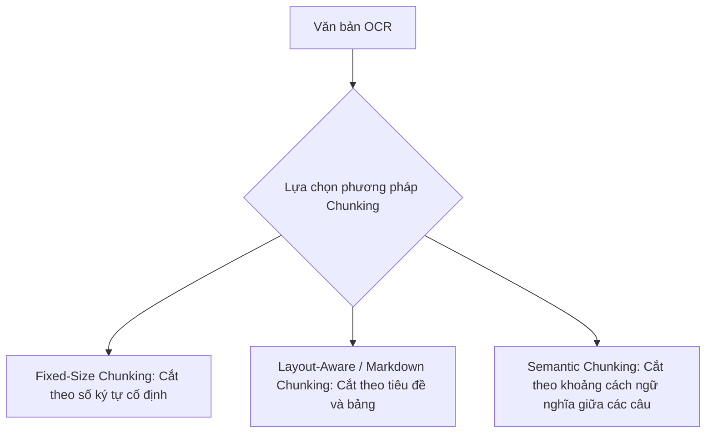
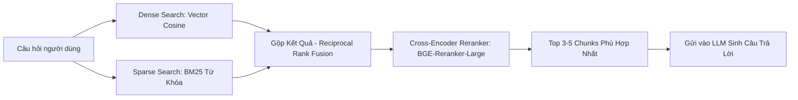

# 03. Chuyên Sâu RAG (Retrieval-Augmented Generation) Cho Tài Liệu OCR

Sau khi OCR trích xuất văn bản từ ảnh/PDF, chúng ta cần đưa dữ liệu này vào hệ thống RAG để người dùng có thể tra cứu, hỏi đáp và trích xuất thông tin một cách chính xác.

---

## 1. Bản Chất Của RAG Cho Tài Liệu OCR (Khác Gì Văn Bản Thông Thường?)

Văn bản thu được từ OCR có các đặc thù sau:
1. **Nhiễu ký tự (Noise):** Có thể xuất hiện ký tự lạ, khoảng trắng ngắt quãng, hoặc lỗi chính tả nhỏ do ảnh mờ.
2. **Mất cấu trúc layout (Lost Hierarchy):** Nếu tài liệu có nhiều cột hoặc bảng biểu, OCR truyền thống có thể đọc từ trái sang phải cắt ngang 2 cột.
3. **Cần lưu kèm Metadata:** Mỗi câu chữ trích xuất cần lưu kèm số trang (`page_number`), tên tệp (`file_name`), và tọa độ vùng ảnh (`bbox`) để phục vụ việc bôi sáng (highlight) cho người dùng đối soát.

---

## 2. Các Chiến Lược Cắt Đoạn Văn Bản (Chunking Strategies)

### Bảng So Sánh Các Chiến Lược Chunking

| Phương Pháp | Cách Hoạt Động | Ưu Điểm | Nhược Điểm | Khi Nào Nên Dùng? |
| :--- | :--- | :--- | :--- | :--- |
| **1. Fixed-Size + Overlap** | Cắt cứng mỗi đoạn 500-1000 ký tự, có 100-200 ký tự gối đầu (overlap) | Dễ cài đặt, chạy cực nhanh | Có thể cắt ngang giữa câu hoặc làm đứt gãy ý nghĩa của một điều khoản | Thử nghiệm nhanh, tài liệu phẳng ít cấu trúc |
| **2. Layout-Aware (Khuyên Dùng)** | Nhận diện tiêu đề H1, H2, đoạn văn và bảng biểu để cắt theo block | Giữ trọn vẹn ngữ cảnh của từng điều mục hoặc nguyên một bảng dữ liệu | Cần OCR engine có khả năng bóc tách layout (như PaddleOCR PP-Structure) | Tài liệu hợp đồng, báo cáo tài chính, tài liệu kỹ thuật |
| **3. Semantic Chunking** | Dùng embedding đo độ tương đồng giữa các câu kế tiếp; nếu có sự chuyển ý thì tách chunk | Độ liền mạch về ý nghĩa cực kỳ cao | Tốn tài nguyên tính toán embedding khi ingest tài liệu | Văn bản pháp luật, bài báo nghiên cứu chuyên sâu |

---

## 3. Lựa Chọn Embedding Model & Vector Database

### A. Embedding Model (Biến văn bản thành Vector)
1. **BGE-M3 (BAAI/bge-m3):** Hỗ trợ đa ngôn ngữ cực tốt (bao gồm tiếng Việt), độ dài tối đa 8192 tokens, hỗ trợ đồng thời cả Dense Search, Sparse Search và ColBERT. *(Rất khuyên dùng cho chạy Local)*
2. **Multilingual-E5-Large (intfloat/multilingual-e5-large):** Mô hình embedding tiếng Việt cực kỳ phổ biến và chính xác.
3. **Gemini Text Embedding (text-embedding-004):** Nhẹ nhàng, gọi qua API, vector 768 chiều, không tốn tài nguyên máy chủ.

### B. Vector Database (Lưu trữ và tìm kiếm vector)
* **ChromaDB:** Nhúng trực tiếp vào Python process (Embedded), lưu file trên đĩa cục bộ. Dễ dùng nhất, không cần cài đặt docker riêng. *(Phù hợp giai đoạn phát triển ban đầu)*
* **Qdrant:** Viết bằng Rust, cực nhanh, hỗ trợ lọc metadata phong phú, tiêu thụ ít RAM, có chế độ in-memory hoặc server. *(Khuyên dùng cho sản phẩm thực tế)*
* **Milvus / pgvector (PostgreSQL):** Dành cho hệ thống quy mô lớn hàng chục triệu vector.

---

## 4. Kỹ Thuật Nâng Cao Để RAG Đạt Độ Chính Xác Tuyệt Đối (Hybrid Search + Reranker)

### Tại sao cần Hybrid Search và Reranker?
1. **Vector Search (Dense):** Giỏi bắt ý nghĩa tương đồng (ví dụ: "chi phí" và "giá tiền"). Nhưng lại kém khi tìm kiếm mã số chính xác (ví dụ: "Mã hợp đồng: HD-2026-991").
2. **BM25 Search (Sparse):** Giỏi tìm kiếm chính xác các từ khóa hiếm, mã định danh, tên riêng.
3. **Reranker:** Sau khi lấy ra 20 kết quả từ tìm kiếm kết hợp, mô hình Reranker sẽ chấm điểm mức độ liên quan thực sự của từng đoạn với câu hỏi, chọn ra 3-5 đoạn xuất sắc nhất để gửi cho LLM. Điều này giúp loại bỏ 90% thông tin rác.
