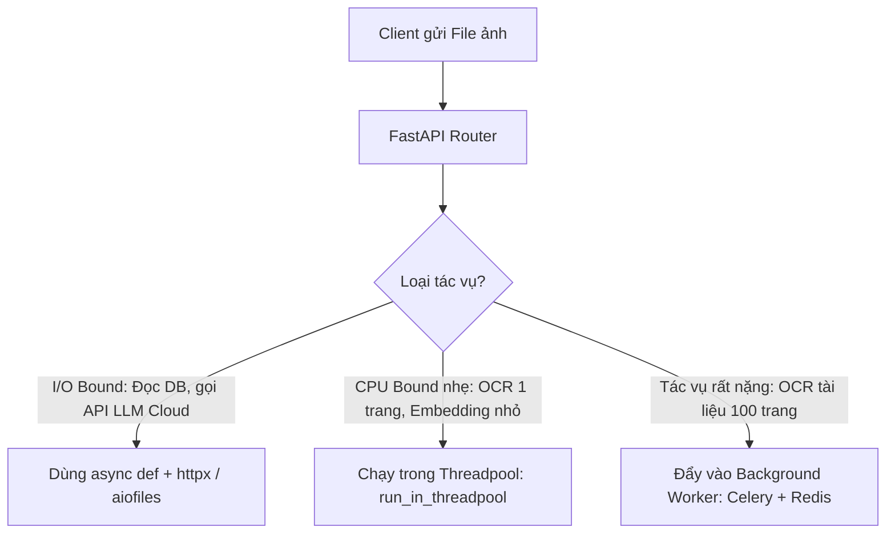
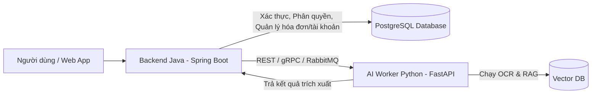

# 04. Kiến Trúc FastAPI & Mô Hình Tích Hợp Backend

FastAPI là framework web Python hiện đại, hiệu năng cao và phổ biến nhất hiện nay cho các ứng dụng trí tuệ nhân tạo (AI), xử lý ngôn ngữ tự nhiên (NLP) và Computer Vision.

---

## 1. Tại Sao Phải Chọn FastAPI Cho Hệ Thống OCR + RAG?

| Tiêu Chí | FastAPI | Flask | Django | Spring Boot (Java) |
| :--- | :--- | :--- | :--- | :--- |
| **Hiệu năng & Tốc độ** | Rất cao (dựa trên Starlette & Uvicorn, hỗ trợ `async/await`) | Trung bình (WSGI đồng bộ truyền thống) | Trung bình | Rất cao (đa luồng JVM) |
| **Hệ sinh thái AI / ML** | **Native Python** (Tương thích trực tiếp với PyTorch, OpenCV, LangChain, LlamaIndex) | Native Python | Native Python | Kém hơn (phải gọi qua JNI hoặc REST tới Python service) |
| **Hỗ trợ Streaming (SSE)** | Rất dễ (`StreamingResponse` để hiển thị chữ chạy từng ký tự như ChatGPT) | Phức tạp hơn | Phức tạp hơn | Tốt (WebFlux) |
| **Kiểm tra kiểu dữ liệu (Validation)** | Tự động với Pydantic (Validate JSON request/response tự động) | Phải tự viết hoặc dùng thư viện ngoài | Dựa trên Django Forms | Dựa trên Java Annotations/Lombok |
| **Tự sinh tài liệu API (Swagger UI)** | Tự động tại `/docs` và `/redoc` | Không có sẵn | Không có sẵn | Cần cấu hình SpringDoc/OpenAPI |

---

## 2. Vấn Đề Quan Trọng Nhất Trong FastAPI Khi Chạy AI: Xử Lý Tác Vụ Nặng (CPU-Bound vs IO-Bound)

### Vấn Đề:
- FastAPI sử dụng **Asynchronous Event Loop** (`async def`). Nếu bạn chạy một tác vụ nặng ngốn CPU (như chạy mô hình OCR hoặc tính toán Embedding) trực tiếp bên trong một hàm `async def`, toàn bộ Event Loop sẽ bị đóng băng (block), khiến các người dùng khác không thể gửi request tới server.

### Giải Pháp & Các Cách Thực Hiện:



1. **Cách 1: `run_in_threadpool` (Cho tác vụ vừa phải):**
   ```python
   from fastapi.concurrency import run_in_threadpool

   @router.post("/ocr")
   async def perform_ocr(file: UploadFile):
       image_bytes = await file.read()
       # Chạy hàm OCR đồng bộ trong thread riêng để không block Event Loop
       result = await run_in_threadpool(sync_ocr_engine.extract, image_bytes)
       return result
   ```
2. **Cách 2: Background Tasks / Celery Task Queue (Cho tài liệu lớn hàng chục trang):**
   - API nhận file, trả về `task_id` ngay lập tức cho client (Response 202 Accepted).
   - Worker chạy ngầm bóc tách ảnh và đẩy vào Vector DB.
   - Client có thể dùng polling hoặc WebSocket để nhận thông báo khi xử lý xong.

---

## 3. Mô Hình Kết Hợp Giữa `backend-java` Và `ai-worker-python`

Dự án có cả 2 thư mục `backend-java` và `ai-worker-python`. Khi nào nên dùng cấu trúc này?



- **Khi nào dùng thuần Python (`ai-worker-python`):** Khi bạn xây dựng ứng dụng tập trung hoàn toàn vào AI, MVP nhanh gọn, ít nghiệp vụ doanh nghiệp cồng kềnh.
- **Khi nào kết hợp với Java (`backend-java`):** Khi hệ thống cần tích hợp vào hạ tầng doanh nghiệp có sẵn, yêu cầu hệ thống phân quyền phức tạp (RBAC), giao dịch ngân hàng/thanh toán, và quản lý luồng phê duyệt tài liệu quy mô lớn.
