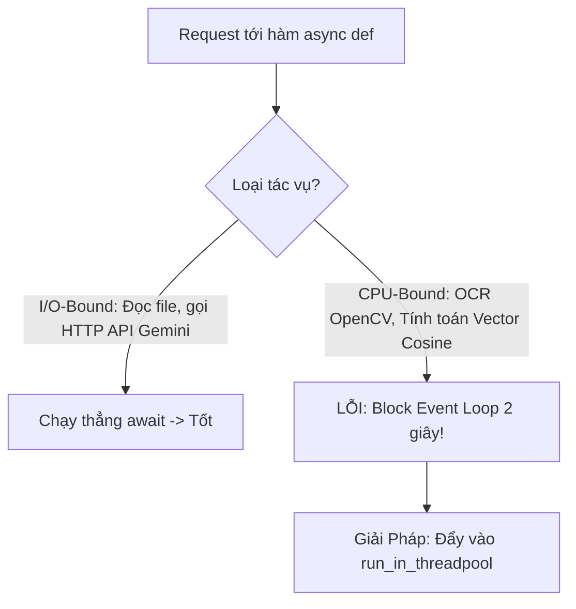

# 📚 GIÁO TRÌNH FASTAPI TOÀN DIỆN: TỪ NỀN TẢNG ĐẾN TRIỂN KHAI HỆ THỐNG AI SẢN XUẤT

> **Mục tiêu tài liệu:** Cung cấp kiến thức toàn diện về kiến trúc Web API hiện đại, giao thức RESTful, cơ chế bất đồng bộ ASGI trong FastAPI, cách đóng gói mô hình AI (OCR & RAG) thành dịch vụ web hiệu năng cao và tương tác trực quan qua Swagger UI.

---

## PHẦN 1: KIẾN THỨC NỀN TẢNG (FOUNDATIONS)

### 1.1. Giao Thức RESTful API & Chuẩn OpenAPI (Swagger)

**REST (Representational State Transfer)** là chuẩn kiến trúc phổ biến nhất để các ứng dụng phần mềm (Web, Mobile, Microservices) giao tiếp với nhau qua giao thức mạng HTTP.

#### 4 Phương Thức HTTP Cốt Lõi:
* **`GET`:** Lấy dữ liệu (An toàn, không làm thay đổi trạng thái server). Ví dụ: `GET /api/v1/rag/stats` (lấy thống kê).
* **`POST`:** Tạo mới hoặc gửi dữ liệu lên để xử lý nặng. Ví dụ: `POST /api/v1/ocr/extract` (gửi ảnh), `POST /api/v1/rag/query` (gửi câu hỏi).
* **`PUT` / `PATCH`:** Cập nhật thông tin đã tồn tại.
* **`DELETE`:** Xóa tài nguyên. Ví dụ: `DELETE /api/v1/documents/{doc_id}`.

#### Các Mã Trạng Thái HTTP Chuẩn (HTTP Status Codes):
* `200 OK`: Xử lý thành công và trả về dữ liệu.
* `201 Created`: Tạo mới tài nguyên thành công (sau khi ingest file).
* `202 Accepted`: Đã tiếp nhận yêu cầu và đang xử lý ngầm (dành cho file PDF lớn).
* `400 Bad Request`: Dữ liệu gửi lên sai định dạng (ví dụ: gửi file .exe thay vì ảnh).
* `404 Not Found`: Không tìm thấy tài liệu yêu cầu.
* `422 Unprocessable Entity`: Lỗi Pydantic Validation (thiếu trường dữ liệu bắt buộc).
* `500 Internal Server Error`: Lỗi sập server bên trong.

#### Chuẩn OpenAPI (Swagger UI) Hoạt Động Thế Nào?
FastAPI tự động đọc cấu trúc các hàm Python và Schema Pydantic để sinh ra một file đặc tả chuẩn `openapi.json`. Từ file này, một giao diện web HTML/JavaScript tương tác (Swagger UI) được tạo ra tại địa chỉ:
$$\text{http://localhost:8000/docs}$$
Tại đây, lập trình viên có thể bấm **"Try it out"**, chọn file ảnh từ máy tính, bấm **"Execute"** và xem phản hồi JSON trả về trực tiếp mà không cần dùng phần mềm bên ngoài như Postman.

---

### 1.2. Kiến Trúc ASGI (Asynchronous Server Gateway Interface) vs WSGI

```text
WSGI (Flask / Django cũ):
[Request 1] ---> [Worker 1 bận xử lý OCR 2s...] ---> [Các request 2, 3, 4 phải xếp hàng chờ]

ASGI (FastAPI + Uvicorn):
[Request 1] ---> [Event Loop] ---> Đẩy tác vụ nặng sang ThreadPool ---> [Trả về ngay cho Request 2, 3]
```

* **WSGI (Web Server Gateway Interface):** Đồng bộ hoàn toàn. Mỗi tiến trình chỉ xử lý 1 request tại 1 thời điểm. Nếu request đó đang gọi OCR hoặc chờ mạng, toàn bộ tiến trình bị block.
* **ASGI (Asynchronous Server Gateway Interface):** Bất đồng bộ dựa trên `asyncio`. Một tiến trình đơn luồng có thể xử lý hàng nghìn kết nối đồng thời (Concurrent Connections) thông qua cơ chế **Non-blocking Event Loop**.

---

### 1.3. Kiểm Định Dữ Liệu Tự Động Với Pydantic

Trước đây trong Flask, bạn phải tự viết hàng chục dòng code kiểm tra:
```python
# Cách cũ thủ công:
if "query" not in request.json or not isinstance(request.json["query"], str):
    return {"error": "Invalid query"}, 400
```
Trong FastAPI với Pydantic, bạn chỉ cần định nghĩa kiểu dữ liệu:
```python
# Cách hiện đại với FastAPI:
class RagQueryRequest(BaseModel):
    query: str
    top_k: int = 4
```
FastAPI sẽ tự động kiểm tra kiểu, chuyển đổi dữ liệu (parsing), trả lỗi `422` nếu người dùng nhập sai, và tự động vẽ form nhập liệu trên Swagger UI!

---

## PHẦN 2: QUY TRÌNH THỰC HIỆN CHI TIẾT (STEP-BY-STEP WORKFLOW)

Quy trình thiết kế hệ thống API cho OCR và RAG:

```mermaid
graph TD
    Client[Client: Web / Mobile / Swagger UI] -->|HTTP Request| Main[app/main.py: App Factory]
    Main --> CORS[CORS Middleware: Cho phép Frontend kết nối]
    Main --> RouterOCR[/api/v1/ocr: Module OCR]
    Main --> RouterRAG[/api/v1/rag: Module RAG]
    Main --> RouterDoc[/api/v1/documents: Quản lý File]
    
    RouterOCR --> OCRService[ImagePreprocessor + OCREngine]
    RouterRAG --> RAGService[RAGPipeline: Chunking + ChromaDB + LLM]
    RouterDoc --> Storage[(storage/)]
```

---

### 2.1. Xử Lý Tải Tệp Ảnh Lớn (`UploadFile` vs `bytes`)

Khi làm việc với ảnh chụp tài liệu hoặc file scan, không nên đọc toàn bộ file vào RAM:
* `UploadFile` của FastAPI sử dụng cơ chế `SpooledTemporaryFile`:
  - Nếu file nhỏ (< 1MB): Lưu tạm trong RAM để đọc nhanh.
  - Nếu file lớn (> 1MB): Tự động ghi tạm vào đĩa cứng (Disk Spooling), tránh làm tràn bộ nhớ RAM (Out-Of-Memory OOM) của máy chủ khi nhiều người cùng tải tài liệu lên một lúc.

---

### 2.2. Cơ Chế Truyền Phát Trực Tiếp (Streaming Response - Server-Sent Events SSE)

#### Tại sao các hệ thống AI đều cần Streaming?
* Nếu không dùng streaming: Người dùng phải nhìn màn hình quay vòng chờ từ 3 đến 8 giây cho đến khi LLM viết xong câu trả lời hoàn chỉnh.
* Khi dùng **Streaming Response (SSE)**: Ngay khi LLM sinh ra từ đầu tiên (sau 0.2 giây), từ đó lập tức được bắn về trình duyệt web. Chữ chạy từng từ (hiệu ứng Typewriter) đem lại cảm giác phản hồi tức thì và chuyên nghiệp.

Cú pháp chuẩn trong FastAPI:
```python
from fastapi.responses import StreamingResponse

@router.get("/chat-stream")
async def chat_stream(query: str):
    async def token_generator():
        for word in pipeline.stream_answer(query):
            yield f"data: {word}\n\n"
    return StreamingResponse(token_generator(), media_type="text/event-stream")
```

---

## PHẦN 3: KIẾN THỨC CHUYÊN SÂU & TỐI ƯU THỰC CHIẾN (ADVANCED TOPICS)

### 3.1. Vấn Đề Cốt Tử: Không Được Làm Đóng Băng Event Loop (CPU-Bound vs I/O-Bound)

Đây là lỗi phổ biến nhất của các kỹ sư khi mới chuyển từ web thông thường sang làm hệ thống Web AI:



* **Tác vụ I/O-Bound:** Chờ mạng, đọc database, gọi API Google Gemini qua HTTP. Dùng `async/await` là tối ưu nhất.
* **Tác vụ CPU-Bound:** Xử lý ảnh OpenCV, ma trận xoay Deskew, mạng nơ-ron OCR, tính toán hàng nghìn vector khoảng cách. Các tác vụ này sử dụng 100% CPU trong nhiều giây.
* **Giải pháp:** Bắt buộc sử dụng `fastapi.concurrency.run_in_threadpool`:
  ```python
  from fastapi.concurrency import run_in_threadpool

  @router.post("/ocr/extract")
  async def extract_ocr(file: UploadFile):
      image_bytes = await file.read()
      # Tác vụ OCR nặng được đẩy sang một Worker Thread riêng trong ThreadPool
      # Event Loop chính vẫn tự do phục vụ các request khác!
      result = await run_in_threadpool(ocr_engine.extract, image_bytes)
      return result
  ```

---

### 3.2. Cấu Hình CORS Middleware Cho Web Frontend

Khi xây dựng giao diện người dùng (Frontend bằng React / Vue / Vite) chạy ở địa chỉ `http://localhost:3000` hoặc `http://localhost:5173`, trình duyệt sẽ chặn không cho Frontend gọi tới Backend tại `http://localhost:8000` do cơ chế bảo mật **Same-Origin Policy**.

Để giải quyết, Backend FastAPI phải khai báo **CORS Middleware**:
```python
from fastapi.middleware.cors import CORSMiddleware

app.add_middleware(
    CORSMiddleware,
    allow_origins=["*"],  # Cho phép tất cả nguồn kết nối trong môi trường phát triển
    allow_credentials=True,
    allow_methods=["*"],  # Cho phép GET, POST, PUT, DELETE
    allow_headers=["*"],
)
```
