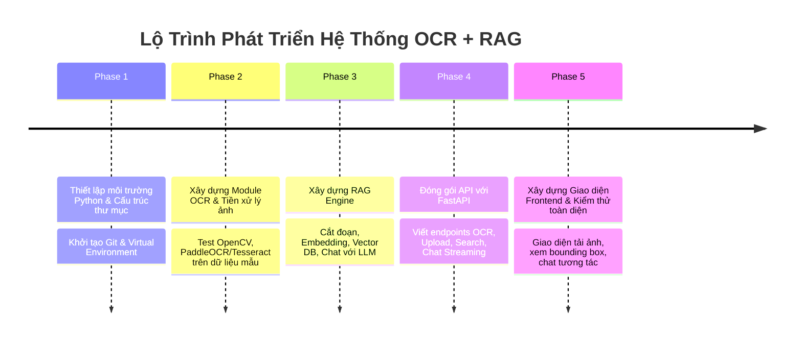

# 05. Lộ Trình Triển Khai Từng Bước (Implementation Roadmap)

Tài liệu này hướng dẫn chi tiết từng bước thực hiện từ khi bắt đầu cho đến khi hoàn thành hệ thống OCR + RAG + FastAPI hoàn chỉnh.

---

## 1. Bản Đồ Lộ Trình Triển Khai (Roadmap)



---

## 2. Chi Tiết Từng Bước Thực Hiện & Lý Do

### Bước 1: Khởi Tạo Môi Trường Python Độc Lập
- **Thao tác:** Tạo virtual environment (`venv`) trong `ai-worker-python` và cài đặt các thư viện lõi.
- **Tại sao phải làm vậy:** Tránh xung đột phiên bản giữa các gói thư viện Python trên máy tính.
- **Lệnh thực hiện:**
  ```powershell
  cd ai-worker-python
  python -m venv venv
  .\venv\Scripts\Activate.ps1
  pip install fastapi uvicorn pydantic opencv-python pillow paddlepaddle paddleocr langchain chromadb sentence-transformers
  ```

---

### Bước 2: Thử Nghiệm Module OCR Trong `research/notebooks/`
- **Thao tác:** Viết một script/notebook nhỏ đọc ảnh mẫu trong `research/sample_data/` và xuất kết quả nhận diện chữ ra màn hình.
- **Tại sao phải làm vậy:** Đánh giá trước độ chính xác của mô hình OCR trên tập dữ liệu tài liệu thực tế của bạn trước khi tích hợp vào hệ thống API phức tạp.
- **Tiêu chí đánh giá:**
  - Nhận diện đúng dấu tiếng Việt.
  - Tốc độ xử lý chấp nhận được (< 2 giây/trang).
  - Tọa độ Bounding Box khớp với vị trí chữ trên ảnh gốc.

---

### Bước 3: Xây Dựng RAG Pipeline Hoàn Chỉnh
- **Thao tác:**
  1. Nhận văn bản từ OCR -> Làm sạch ký tự thừa.
  2. Áp dụng Text Splitter để chia thành các chunks (ví dụ: chunk_size=500, overlap=100).
  3. Dùng mô hình Embedding (`bge-m3` hoặc API) để tạo vector và lưu vào `ChromaDB` (thư mục `storage/vector_db`).
  4. Viết hàm truy vấn: Nhận câu hỏi -> Tìm chunk phù hợp -> Tạo prompt -> Gọi LLM trả lời.
- **Tại sao phải làm vậy:** Đây là "bộ não" trả lời câu hỏi thông minh của hệ thống.

---

### Bước 4: Viết REST API Với FastAPI Trong `ai-worker-python/app/`
- **Thao tác:** Xây dựng các router API chuẩn:
  - `POST /api/v1/ocr/extract`: Tải ảnh lên và nhận về JSON chứa text + bounding box.
  - `POST /api/v1/documents/upload`: Tải tài liệu lên, tự động chạy OCR, cắt đoạn và lưu vào Vector DB.
  - `POST /api/v1/rag/query`: Đặt câu hỏi và nhận câu trả lời dạng JSON.
  - `GET /api/v1/rag/chat-stream`: Chat với tài liệu theo dạng Streaming từng từ (SSE).
- **Tại sao phải làm vậy:** Chuẩn hóa giao diện giao tiếp để bất kỳ Frontend nào (Web, Mobile) hoặc Backend khác (Java) đều có thể kết nối dễ dàng.

---

### Bước 5: Kết Nối Frontend Hoặc Test Trên Swagger UI
- **Thao tác:**
  - Truy cập `http://localhost:8000/docs` để test trực tiếp tất cả API trên giao diện Swagger tự động của FastAPI.
  - Xây dựng giao diện Web đơn giản (React/HTML) cho phép người dùng kéo thả file tài liệu và có khung chat hỏi đáp.
- **Tại sao phải làm vậy:** Đem lại trải nghiệm người dùng trực quan, hoàn thiện sản phẩm cuối cùng.
