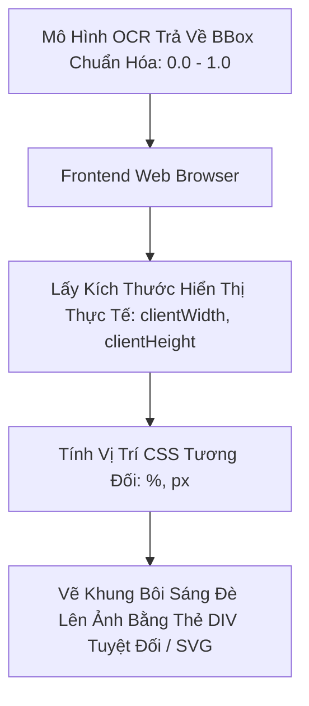
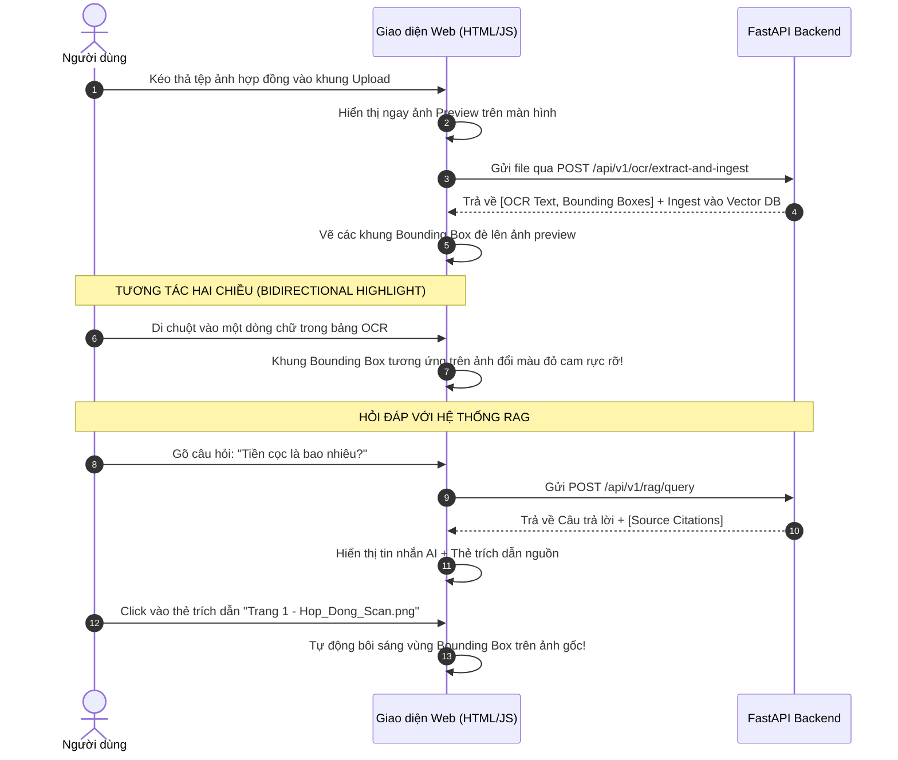

# 📚 GIÁO TRÌNH FRONTEND TOÀN DIỆN: VẼ BOUNDING BOX TƯƠNG TÁC & GIAO DIỆN CHAT RAG

> **Mục tiêu tài liệu:** Hướng dẫn chi tiết cách xây dựng giao diện người dùng hiện đại, trực quan để kết nối với hệ thống OCR và RAG: từ kỹ thuật xử lý kéo thả tệp (Drag-and-Drop), công thức toán học định vị Bounding Box đè lên ảnh tài liệu phản hồi (Responsive), đến luồng tương tác 2 chiều và giao diện Chatbot thông minh.

---

## PHẦN 1: KIẾN THỨC NỀN TẢNG (FOUNDATIONS)

### 1.1. Nguyên Lý Hiển Thị Bounding Box Đè Lên Ảnh Trên Trình Duyệt Web

Khi mô hình OCR trả về tọa độ Bounding Box, làm thế nào để vẽ một khung viền hình chữ nhật chính xác $100\%$ đè lên dòng chữ trên ảnh, bất kể người dùng mở web trên màn hình máy tính 4K, laptop hay điện thoại di động?



#### A. Tại sao tọa độ Pixel tuyệt đối từ Backend sẽ bị lệch trên Web?
* Giả sử ảnh gốc scan có độ phân giải $2400 \times 3200$ pixel. Tọa độ của dòng tiêu đề là:
  $$x_1 = 300, \quad y_1 = 400, \quad x_2 = 2100, \quad y_2 = 550$$
* Khi đưa vào trang web, thẻ `` thường bị giới hạn kích thước theo khung nhìn (ví dụ chiều rộng chỉ còn $600$ pixel, co lại 4 lần).
* Nếu bạn đặt thẻ `div` bôi sáng với `left: 300px, top: 400px`, khung đó sẽ bay ra ngoài hoặc lệch hoàn toàn so với dòng chữ!

#### B. Giải Pháp: Sử Dụng Tọa Độ Chuẩn Hóa (Normalized Coordinates) & Phần Trăm (%)
Backend đã tính sẵn tọa độ chuẩn hóa trong dải $[0.0, 1.0]$:
$$x_{\text{norm}} = \frac{x_{\text{pixel}}}{W_{\text{ảnh gốc}}}, \quad y_{\text{norm}} = \frac{y_{\text{pixel}}}{H_{\text{ảnh gốc}}}$$

Khi hiển thị trên Frontend, ta chỉ cần đặt ảnh trong một thẻ bao bọc có `position: relative`, và các khung Bounding Box có `position: absolute`:
$$\text{left} = x_{\min} \times 100\%$$
$$\text{top} = y_{\min} \times 100\%$$
$$\text{width} = (x_{\max} - x_{\min}) \times 100\%$$
$$\text{height} = (y_{\max} - y_{\min}) \times 100\%$$

👉 **Kết quả:** Dù trình duyệt bị co giãn, phóng to hay thu nhỏ, các khung Bounding Box sẽ luôn bám dính chính xác từng nét chữ!

---

### 1.2. Cơ Chế Kéo Thả Tệp Hiện Đại (HTML5 Drag & Drop API)

Để người dùng không phải bấm nút duyệt file tẻ nhạt, ta sử dụng các sự kiện kéo thả của HTML5:
1. `dragover`: Khi người dùng rê chuột cầm theo file đi vào vùng thả. Ta gọi `e.preventDefault()` để ngăn trình duyệt tự động mở file dưới dạng đường dẫn mới.
2. `dragleave`: Khi người dùng kéo file ra khỏi vùng thả (xóa hiệu ứng viền nổi bật).
3. `drop`: Khi người dùng thả chuột. Lấy danh sách tệp qua `e.dataTransfer.files[0]`.

#### Xem trước ảnh tức thì (Instant Image Preview):
Không cần đợi server tải lên xong mới hiển thị ảnh, ta sử dụng `FileReader` API để đọc file thành chuỗi Base64 Data URL (`reader.readAsDataURL(file)`) và gán thẳng vào `img.src`. Nhờ đó người dùng thấy ảnh xuất hiện ngay lập tức trong 0.01 giây!

---

## PHẦN 2: QUY TRÌNH THỰC HIỆN CHI TIẾT (STEP-BY-STEP WORKFLOW)



---

### 2.1. Tương Tác Hai Chiều (Bidirectional Highlighting)

Đây là tính năng trải nghiệm người dùng (UX) chuyên nghiệp thường thấy trong các sản phẩm xử lý tài liệu cao cấp (như Adobe Acrobat, Google Document AI):
1. **Từ Text sang Ảnh:** Mỗi dòng chữ trong danh sách OCR được gắn thuộc tính `data-line-id="line-3"`. Khung Bounding Box trên ảnh cũng mang `id="bbox-line-3"`. Khi sự kiện `mouseenter` xảy ra ở dòng text, ta kích hoạt class `.active` cho BBox trên ảnh.
2. **Từ Ảnh sang Text:** Khi click vào một khung viền trên ảnh, danh sách văn bản tự động cuộn (Smooth Scroll) tới dòng chữ tương ứng và bôi đậm.

---

### 2.2. Cơ Chế Giao Tiếp API Bằng Fetch & FormData

Vì tệp ảnh là dữ liệu nhị phân (Binary data), không thể gửi qua JSON thông thường mà phải đóng gói vào đối tượng `FormData`:

```javascript
const formData = new FormData();
formData.append("file", file);
formData.append("document_id", "DOC_" + Date.now());

const response = await fetch("http://localhost:8000/api/v1/ocr/extract-and-ingest", {
    method: "POST",
    body: formData
});
const result = await response.json();
```

---

## PHẦN 3: KIẾN THỨC CHUYÊN SÂU & TỐI ƯU GIAO DIỆN (ADVANCED TOPICS)

### 3.1. So Sánh Các Kỹ Thuật Vẽ Bounding Box: HTML Divs vs SVG vs HTML5 Canvas

| Tiêu Chí | 1. Thẻ HTML `<div>` Tuyệt Đối | 2. SVG Overlay (`<svg>`) | 3. HTML5 Canvas 2D |
| :--- | :--- | :--- | :--- |
| **Độ phức tạp** | **Rất dễ**, chỉ cần CSS `top`, `left`, `width`, `height` | Trung bình (cần tính toán thẻ `<rect>`) | Phức tạp (phải tự viết thuật toán vẽ lại mỗi khi resize) |
| **Hỗ trợ hình đa giác xiên (Polygon 4 góc)** | Kém (chỉ hỗ trợ hình chữ nhật thẳng) | **Rất xuất sắc** (dùng `<polygon points="...">`) | Rất xuất sắc |
| **Bắt sự kiện chuột (Hover, Click, Tooltip)** | **Cực kỳ mượt mà**, dùng native CSS hover và DOM events | Rất tốt, mỗi rect là 1 DOM element | Phức tạp (phải tự tính tọa độ chuột có va chạm vào hình không) |
| **Khuyên dùng khi** | **Giao diện chuẩn, Bounding Box chữ nhật (Khuyên dùng)** | Tài liệu có chữ xoay xiên, bảng biểu uốn lượn | Ứng dụng xử lý hàng chục nghìn box cùng lúc |

---

### 3.2. Thiết Kế Giao Diện Chia Đôi Hiện Đại (Split-Screen View)

Một giao diện chuẩn cho hệ thống OCR + RAG thường chia thành 2 hoặc 3 cột:
* **Cột Trái (hoặc Trung tâm):** Trình xem tài liệu (Document Viewer) hiển thị ảnh gốc và lớp phủ Bounding Box.
* **Cột Phải:** Khung Chatbot tương tác (Chat Interface) hiển thị hội thoại, câu trả lời của AI và các thẻ trích dẫn nguồn (Source Badges).
